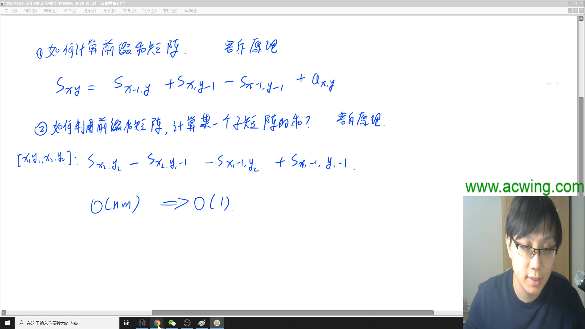

# 蓝桥杯C++AB组课程笔记

[TOC]

## 第一讲 递归与递推

> 由数据范围反推算法复杂度以及算法内容。链接：https://www.acwing.com/blog/content/32/
>
> - 一般ACM或者笔试题的时间限制是1秒或2秒。
>   在这种情况下，C++代码中的操作次数控制在 10^7^∼10^8^为最佳。
> - 下面给出在不同数据范围下，代码的时间复杂度和算法该如何选择：
> - n≤30, 指数级别, dfs_abc+剪枝，状态压缩dp
>   n≤100 => O(n^3^)，floyd，dp，高斯消元
>   n≤1000 => O(n^2^)，O(n^2^logn)，dp，二分，朴素版Dijkstra、朴素版Prim、Bellman-Ford
>   n≤10000 => O(n∗√n)，块状链表、分块、莫队
>   n≤100000 => O(nlogn) => 各种sort，线段树、树状数组、set/map、heap、拓扑排序、dijkstra+heap、prim+heap、Kruskal、spfa、求凸包、求半平面交、二分、CDQ分治、整体二分、后缀数组、树链剖分、动态树
>   n≤1000000 => O(n), 以及常数较小的 O(nlogn) 算法 => 单调队列、 hash、双指针扫描、并查集，kmp、AC自动机，常数比较小的 O(nlogn) 的做法：sort、树状数组、heap、dijkstra、spfa
>   n≤10000000 => O(n)，双指针扫描、kmp、AC自动机、线性筛素数
>   n≤10^9^ => O(√n)，判断质数
>   n≤10^18^ => O(logn)，最大公约数，快速幂，数位DP
>   n≤10^1000^ => O((logn)^2^)，高精度加减乘除
>   n≤10^100000^ => O(logk×loglogk)，k表示位数，高精度加减、FFT/NTT

题目描述 => 抽象出模型 <=> 检查时间复杂度

- 时间复杂度通常能够给解题方向提供思路，限定算法

递归：

- 指数型枚举
- 全排列型枚举
- 组合型枚举

全排列型枚举：

- 顺序1：依次枚举每个数放在哪个位置
- 顺序2：依次枚举每个位置放哪个数

组合型枚举：

- 和排列相似，但排列需要顺序，组合不要求顺序
- 将组合问题人为排序，即可以获得一个“不重”的答案
  - 限制从小大大排序：（局部）只需要保证每次新加的数都大于前面的数

考虑搜索树递归需要的参数

1. 结果/路径数组 ways[]
2. 当前应该枚举哪个位置
3. start 当前最小可以从哪个地方开始枚举

对于考试时

- 最先追求 AC
- 在常数比较小（硬代码量较少）的时候，可以考虑暴力

关于二维数组的定义

```bash
  	 y    ——→
x	| (x1, y1) | (x1, y2) |
↓   | (x2, y1) | (x2, y2) |
    | (x3, y1) | (x3, y2) |
```

由初试状态转移到最终状态的最短方案

- 一般使用 bfs

## 第二讲 二分与前缀和

整数二分

1. 确定一个区间，使得目标值一定在区间内
2. 找一个判断条件，使得具备性质
   - 性质具有二段性（前一段必定满足，后一段必定不满足，分界点无缝连接）
   - 答案一定是二段性的分界点
3. 分析终点M在该判断条件下是否成立，如果成立或者不成立，考虑答案在哪个区间
4. 如果更新方式为 N=Mid，则不需要任何处理；如果更新方式为 L=Mid，则需要在计算 Mid 时 +1.

```c++
// 1. 查找lower_bound【第一个>=target的数】。所有解中最小的
// 条件改为 array[mid] > target 就是查找 upper_bound【第一个>target的数】
int left = 0, right = n;
while (left < right) {
    int mid = (left + right) / 2;
    if (array[mid] >= target)
        right = mid;
    else
        left = mid + 1;
}
return right;

// 1. 查找【第一个<=target的数】。所有解中最大的
// 条件改为 array[mid] < target 就是查找 upper_bound【第一个<target的数】
int left = -1, right = n - 1;
while (left < right) {
    int mid = (left + right + 1) / 2;
    if (array[mid] <= taget) 
        left = mid;
    else
        right = mid - 1;
}
return right;

// 若必定合法，则可以：left = 0, right = n - 1; 但没有必要
// 终止于 left == right
// 永远包含合法并抛弃非法
```


实数二分

- 由于一定能把区间严格二分，所以必定能够将区间缩小到要求范围
- 由于稠密，所以改变 l、r 值时直接用 m 赋值，不要做 ±1

二分的性质

- 单调一定可以二分
- 但二分不一定单调

机器人跳跃问题

- 要注意到，当数据指数型上升时，即使是long long也可能包不住
- 要合理推导，发现规律，避免不必要的计算

四平方和问题

- 思考将4个变量换成枚举三个变量
- 通过空间存储2个变量的枚举。再通过相同时间，枚举剩余两个变量，用O(1)查询之前枚举的结果。

前缀和

- 一维前缀和和二维前缀和。注意好下标即可。



调试小技巧：

- `exit(0)` 可以让程序在任意位置正常退出，通过二分代码位置，可以用来调试 `segment fault` 错误，一般是越界。

关于数组开的很大时

- 用不到的空间，操作系统会帮我们优化，所以基本不用在意空间。

## 第三讲 数学与简单DP

如果遇到脑筋急转弯

1. 尽力分析
2. 打表找规律
3. 
