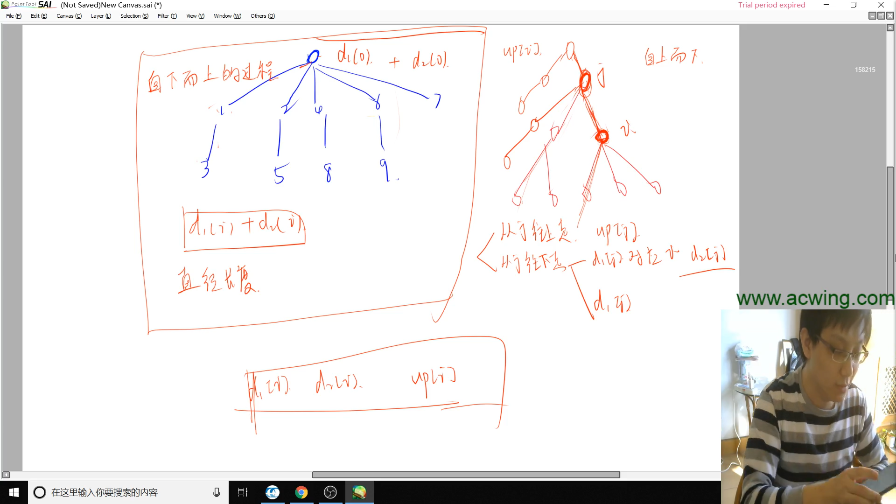

# 蓝桥杯C++AB组课程笔记

[TOC]

## 第一讲 递归与递推

> 由数据范围反推算法复杂度以及算法内容。链接：https://www.acwing.com/blog/content/32/
>
> - 一般ACM或者笔试题的时间限制是1秒或2秒。
>   在这种情况下，C++代码中的操作次数控制在 10^7^∼10^8^为最佳。
> - 下面给出在不同数据范围下，代码的时间复杂度和算法该如何选择：
> - n≤30, 指数级别, dfs_abc+剪枝，状态压缩dp
>   n≤100 => O(n^3^)，floyd，dp，高斯消元
>   n≤1000 => O(n^2^)，O(n^2^logn)，dp，二分，朴素版Dijkstra、朴素版Prim、Bellman-Ford
>   n≤10000 => O(n∗√n)，块状链表、分块、莫队
>   n≤100000 => O(nlogn) => 各种sort，线段树、树状数组、set/map、heap、拓扑排序、dijkstra+heap、prim+heap、Kruskal、spfa、求凸包、求半平面交、二分、CDQ分治、整体二分、后缀数组、树链剖分、动态树
>   n≤1000000 => O(n), 以及常数较小的 O(nlogn) 算法 => 单调队列、 hash、双指针扫描、并查集，kmp、AC自动机，常数比较小的 O(nlogn) 的做法：sort、树状数组、heap、dijkstra、spfa
>   n≤10000000 => O(n)，双指针扫描、kmp、AC自动机、线性筛素数
>   n≤10^9^ => O(√n)，判断质数
>   n≤10^18^ => O(logn)，最大公约数，快速幂，数位DP
>   n≤10^1000^ => O((logn)^2^)，高精度加减乘除
>   n≤10^100000^ => O(logk×loglogk)，k表示位数，高精度加减、FFT/NTT

题目描述 => 抽象出模型 <=> 检查时间复杂度

- 时间复杂度通常能够给解题方向提供思路，限定算法

递归：

- 指数型枚举
- 全排列型枚举
- 组合型枚举

全排列型枚举：

- 顺序1：依次枚举每个数放在哪个位置
- 顺序2：依次枚举每个位置放哪个数

组合型枚举：

- 和排列相似，但排列需要顺序，组合不要求顺序
- 将组合问题人为排序，即可以获得一个“不重”的答案
  - 限制从小大大排序：（局部）只需要保证每次新加的数都大于前面的数

考虑搜索树递归需要的参数

1. 结果/路径数组 ways[]
2. 当前应该枚举哪个位置
3. start 当前最小可以从哪个地方开始枚举

对于考试时

- 最先追求 AC
- 在常数比较小（硬代码量较少）的时候，可以考虑暴力

关于二维数组的定义

```bash
  	 y    ——→
x	| (x1, y1) | (x1, y2) |
↓   | (x2, y1) | (x2, y2) |
    | (x3, y1) | (x3, y2) |
```

由初试状态转移到最终状态的最短方案

- 一般使用 bfs

## 第二讲 二分与前缀和

整数二分

1. 确定一个区间，使得目标值一定在区间内
2. 找一个判断条件，使得具备性质
   - 性质具有二段性（前一段必定满足，后一段必定不满足，分界点无缝连接）
   - 答案一定是二段性的分界点
3. 分析终点M在该判断条件下是否成立，如果成立或者不成立，考虑答案在哪个区间
4. 如果更新方式为 N=Mid，则不需要任何处理；如果更新方式为 L=Mid，则需要在计算 Mid 时 +1.

```c++
// 注：必须严格按照模板！

// 1. 查找lower_bound【第一个>=target的数】。所有解中最小的
// 条件改为 array[mid] > target 就是查找 upper_bound【第一个>target的数】
int left = 0, right = n;
while (left < right) {
    int mid = (left + right) / 2;
    if (target <= array[mid])
        right = mid;
    else
        left = mid + 1;
}
return right;

// 1. 查找【第一个<=target的数】。所有解中最大的
// 条件改为 array[mid] < target 就是查找 upper_bound【第一个<target的数】
int left = -1, right = n - 1;
while (left < right) {
    int mid = (left + right + 1) / 2;
    if (array[mid] <= taget) 
        left = mid;
    else
        right = mid - 1;
}
return right;
```


实数二分

- 由于一定能把区间严格二分，所以必定能够将区间缩小到要求范围
- 由于稠密，所以改变 l、r 值时直接用 m 赋值，不要做 ±1

二分的性质

- 单调一定可以二分
- 但二分不一定单调

机器人跳跃问题

- 要注意到，当数据指数型上升时，即使是long long也可能包不住
- 要合理推导，发现规律，避免不必要的计算

四平方和问题

- 思考将4个变量换成枚举三个变量
- 通过空间存储2个变量的枚举。再通过相同时间，枚举剩余两个变量，用O(1)查询之前枚举的结果。

前缀和

- 一维前缀和和二维前缀和。注意好下标即可。


调试小技巧：

- `exit(0)` 可以让程序在任意位置正常退出，通过二分代码位置，可以用来调试 `segment fault` 错误，一般是越界。

关于数组开的很大时

- 用不到的空间，操作系统会帮我们优化，所以基本不用在意空间。

## 第三讲 数学与简单DP

如果遇到脑筋急转弯

1. 尽力分析
2. 打表找规律

求上取整

- $$
  \left \lceil \frac{logs}{b} \right \rceil = \left \lfloor \frac{logs + b - 1}{b} \right \rfloor
  $$

  

闫氏DP分析法

- 找最后一个不同点
- 一切围绕集合的定义展开
- 

摘花生分析

- 

对称关系：分析两个变量是否地位等同

最长上升子序列分析

- 

地宫取宝分析

- 

等式代表着我们能够直接计算一个未知变量

波动数列分析

- 
- 

dp 是不带环的最短路问题，不能处理有环

## 第四讲 枚举、模拟与排序

做题思路

1. 顺序，不重不漏
2. 优化，等价变形

无穷大 https://zhuanlan.zhihu.com/p/57512786

- INF = 0x3f3f3f3f; minv = INF, maxv = -INF;
- 将某个数组清零，通常会使用 `memset(logs, 0, sizeof(logs))`
- 要把一段内存全部置为无穷大，只需要 `memset(logs, 0x3f, sizeof(logs))`

考虑一个最好写的算法

1. 时间复杂度
2. 空间复杂度
3. 代码复杂度

归并模板

```c++
void mergeSort(vector<int>& nums, int left, int right) {
    if (left >= right)
        return;
    int mid = left + (right - left) / 2;
    mergeSort(nums, left, mid);
    mergeSort(nums, mid + 1, right);
    merge(nums, left, mid, right);
}

void merge(vector<int>& nums, int left, int mid, int right) {
    vector<int> tmp(right - left + 1);
    int i = left, j = mid + 1, k = 0;
    while (i <= mid && j <= right) 
    	tmp[k++] = nums[i] < nums[j] ? nums[i++] : nums[j++];
    while (i <= mid) 
        tmp[k++] = nums[i++];
    while (j <= right) 
        tmp[k++] = nums[j++];
    for (i = left, k = 0; i <= right;) 
        nums[i++] = tmp[k++];
}
```

## 第五讲 树状数组与线段树(TODO)


## 第六讲 双指针、BFS与图论

双指针

- j 和 i 一起在开头被声明
- i、j 各自在双层循环中不减少，即 O(n) 复杂度

先考虑暴力，再考虑优化

宽搜

1. 判重数组（绝大部分是入队时判重）

2. queue

3. ```python
   while !queue
   	t <- q.head
       for t拓展
       	ver 新节点
           if !st[ver]
           	ver -> q.rear
   ```

bfs性质

- 宽搜可以搜环，因为有判重数组。
- bfs能找最小步数

置换群

- 将当前的瓶子的位置指向其应该在的位置
- 必定是：出度为 1，入度为 1，组成若干个环
- 最终结果应该是每个点自己指向自己
- 转换情况
  - 情况一：交换同一个环内的点 -> 裂成两个环
  - 情况二：交换不同环的点 -> 合并两个环
- 初始有 K 个环，最终希望变成 N 个环。由于每次操作最多只能增加一个换，故必然存在一种方案，交换 N - K 次，将 K 个环变成 N 个环。

找连通块

1. 遍历（bfs、dfs）
2. 并查集

一棵树的最长路径，也称为树的直径

- 不存在环
- 不是最优化问题，两点之间的路线唯一

查找树的直径

1. 任意取一点 x，计算其他点到 x 的距离 dist1[]
2. 找到距离 x 最远的点 y，计算其他点到 y 的距离 dist2[]
3. dist2[] 中的最大值即为答案

证明

- 
- 时间复杂度 O(n)

图的存储

- 邻接数组（不适合稀疏矩阵）
- 邻接表
  - vector
  - 单链表

单链表

- >  一般在笔试中不使用 struct 结构体实现的单链表，因为 new 运算符速度极慢

- 一般使用数组模拟链表

  - 单链表：邻接表，存储树。图
  - 双链表：优化某些问题

## 第七讲 贪心(TODO)


## 第八讲 数论(TODO)

欧几里得算法（辗转相除法）

- 最大公约数：(s, b) 或者 gcd(s, b)

  - (s, b) = (b, s mod b) 

  - 

  - ```c++
    #include <iostream>
    
    using namespace std;
    
    // 欧几里得算法求最大公约数
    
    int gcd(int s, int b) {
        printf("s=%d b=%d \n", s, b);
        // printf("a模b=%d\n", (s % b));
        return b ? gcd(b, s % b) : s;
    }
    
    int main() {
        int s, b;
        cin >> s >> b;
        cout << gcd(s, b) << endl;
    }
    ```

- 最小公倍数：[s, b] 或者 lcm(s, b)

算数基本定理

- $$
  N = P_{1}^{α_{1}} × P_{2}^{α_{2}} × …… × P_{k}^{α_{k}}, 其中 P_{i}是质数, α_{i} > 0
  $$

- 多重集的排列数问题

  - 

- 分解质因数

  - 筛法求素数，线性筛法。在 O(n) 时间找出 1~n 中所有质数、以及每个数的最小质因子

    - 筛掉的的一定是合数
    - 一定是被最小质因子筛的
    - 合数一定会被筛掉

  - ```c++
    #include <cstdio>
    
    const int N = 1e6 + 10;
    
    int primes[N], min_p[N], cnt;  // 存所有质数 最小质因数 存所有质数用的指针
    bool st[N];  // 当前数有没有被筛过
    
    int get_primes(int n) {
        for (int i = 2; i <= n; ++i) {  // 枚举 2~n 范围内的没一个数
            if (!st[i])  // 发现质数
                min_p[i] = i, primes[cnt++] = i;  // 质数的最小质因子是自己 添加到质数列表中去
            for (int j = 0; primes[j] * i <= n; j++) {  // 枚举之前的质数再相乘，向后筛去相关合数
                st[primes[j] * i] = true;  // 筛掉这个数
                min_p[primes[j] * i] = primes[j];  // 存它的最小质因子
                if (i % primes[j] == 0)
                    break;
            }
        }
    }
    
    int main() {
        get_primes(100000);
        for (int i = 0; i < 20; i++)
            printf("%d\n", primes[i]);
        for (int i = 0; i < 20; i++)
            printf("%d\n", min_p[i]);
    }
    
    ```

  - 

约数和定理

- 由 $N = P_{1}^{α_{1}} × P_{2}^{α_{2}} × …… × P_{k}^{α_{k}}$
  - 约数个数：$(α_{1} + 1) × (α_{2} + 1) × …… × (α_{k} + 1)$
    - 证 $d = P_{1}^{β_{1}} × P_{2}^{β_{2}} × …… × P_{k}^{β_{k}}$，
    - d 是 N 的约数，
    - 可知 $0 ≤ β_{i} ≤ α_{i}$。
  - 约数之和：$(1 + P_{1} + P_{1}^{2} + …… + P_{1}^{α_{1}}) × (1 + P_{1} + P_{1}^{2} + …… + P_{1}^{α_{2}}) × …… × (1 + P_{1} + P_{1}^{2} + …… + P_{1}^{α_{k}})$


## 第九讲 复杂DP

鸣人的影分身

- 最小值为 0；最小值不为 0
- 整数划分（集合的一一映射）
- 

糖果

- 

密码脱落

- 增加一个使之左右配对；等价于删掉其中某一个
- 总长度 - 最长回文串长度
- 如何找到一个最长回文子序列
- 

区间dp循环

- ```c++
  for 区间长度
      for 左端点
  ```

生命之树

- 树形dp
- 

斐波那契前 n 项和

- 矩阵快速幂
- 矩阵快速幂求第 n 项
  - 
- 矩阵快速幂求前 n 项和
  - 

包子凑数

- 只要最大公约数是 1，则一定有解
- 
- 

括号配对

- 

旅游规划

- 另一种求树的直径的方法：（换根法）
  - 选取一点作为根，向下寻找每个子树的高度，值最大的两个节点就有可能是在树的直径上
- 

垒骰子

- dp 分析
  - 
- 快速幂优化
  - 
- 


## 第十讲 疑难杂题(TODO)


## 第十一届蓝桥杯省赛第一场C++A/B组真题

- 整数拼接
  - 遇到 TLE，则先考虑等式变形
  - ans++ 者，考虑换成 ans += 统计数
  - 第两层循环换成常数次查找
  - 输入数据多可以 O(n) 预处理

- 网络分析
  - 维护连通性，并查集基础操作
  - 每个点的真实值 = 该点到根节点的路径权值和
  - 合并两树时，
    - 或将一个根上的权值减去新根上的权值
    - 或建立空权值的新根

## 第十二届蓝桥杯省赛第一场C++A/B/C组真题(TODO)


## 第十二届蓝桥杯省赛第二场C++B组真题(TODO)


