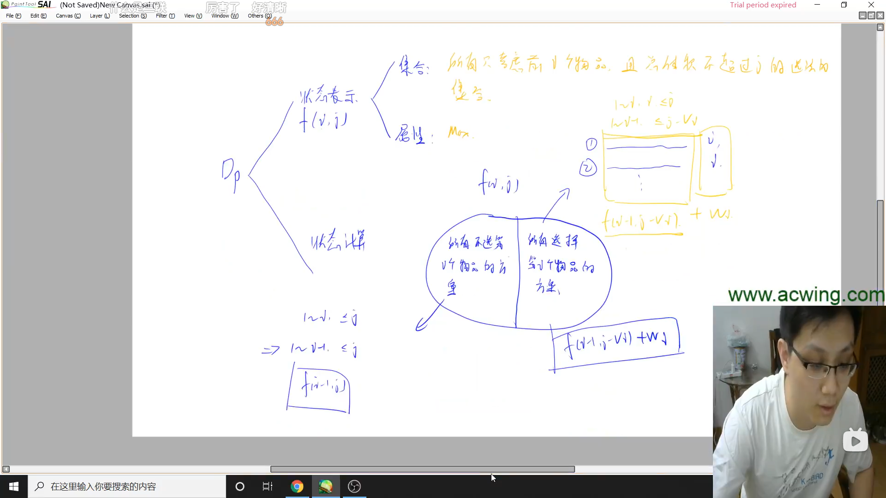
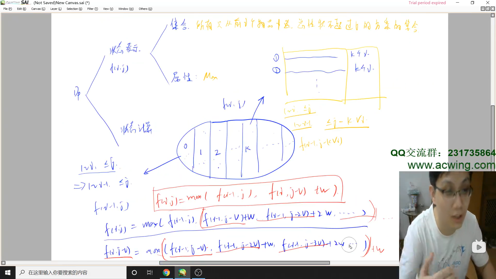
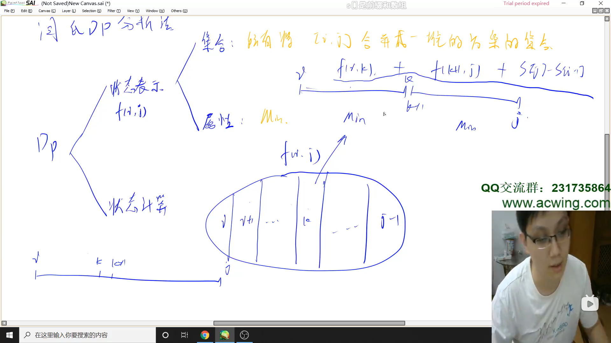
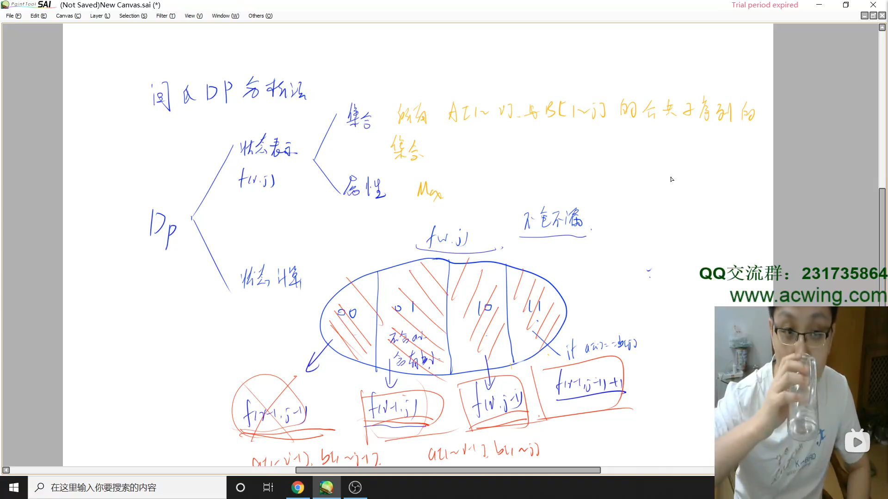

# 闫氏 DP 分析法

> https://www.bilibili.com/video/BV1X741127ZM

## 套路概述

DP 本质是一个有限集合的最优化问题

动态规划

- 状态表示（化零为整）
  
    - 表示的是什么样的一个集合：f[n]
    - 存的数和集合是什么关系，代表什么属性：Max/Min/Count

- 状态计算（化整为零）

    - 一般是分为若干个不重不漏的子集，分别求每个子集，然后合并

子集的划分依据：“寻找最后一个不同点”

## 举例

### 01背包 https://www.acwing.com/problem/content/2/

总共 2^N^ 个方案，从中选择价值最大的一个

- 状态表示：f[i][j]
  
  - （选择问题）一般第一维都是选择前i个物品，后续的都是各种限制，体积、重量限制
  - 集合：**所有只考虑前 i 个物品，并且总体积不超过 j 的选法的集合**（要严格抓住对集合的定义，一切从集合定义出发）
  - 属性：max（问的是啥就是啥）
  
- 状态计算：

  - 所有不选择 i 个物品的方案
    
    - 由于不选择第 i 个物品，所以等价于 f[i - 1][j]
    
  - 所有选择 i 个物品的方案
  
    - 由于选择第 i 个物品，第 i 个物品是固定了其所需要的体积的，所以等价于 f[i - 1][j - v[i]] + w[i]

转移方程：`f[i][j] = max(f[i - 1][j], f[i - 1][j - v[i]] + w[i])`

> DP 优化：所有优化都是在对代码做等价变形

### 完全背包 https://www.acwing.com/problem/content/3/

- 状态表示：f[i][j]

  - 集合：**所有只考虑前 i 个物品，并且总体积不超过 j 的选法的集合**
  - 属性：max

- 状态计算：

  - 所有不选择第 i 个物品的方案
    
    - 状态转移：f[i - 1][j]
    
  - 所有选择第 i 个物品 1 次的方案
  - 所有选择第 i 个物品 2 次的方案
  - ……
  - 所有选择第 i 个物品 k 次的方案（体积不超过上限）
  
    - f[i - 1][j - k * v[i]] + k * w[i]

转移方程：`f[i][j] = max(f[i - 1][j], f[i - 1][j - v[i]] + w[i], f[i - 1][j - 2 * v[i]] + 2 * w[i], ……, f[i - 1][j - k * v[i]] + k * w[i])`

变形： `f[i][j - v[i]] = max(f[i - 1][j- v[i]], f[i - 1][j - 2 * v[i]] + w[i], ……, f[i - 1][j - k * v[i]] + (k - 1) * w[i]) + w[i]`

最终的转移方程：`f[i][j] = max(f[i - 1][j], f[i][j - v[i]] + w[i])`

### 石子合并 https://www.acwing.com/problem/content/284/

有顺序、要求相邻，选择方案有 (n - 1)! 个，很大但有限，可以使用 DP。

- 状态表示：f[i][j]

  - 集合：**所有将 [i, j] 合并成一堆的方案的集合**（整道题的基础，必须认真思考）
    
    - i, k, k+1, ..., j
    
  - 属性：min

- 状态计算：

  - 以“两个堆合并的划分点”作为选择的依据
  - 对于 f[i][j]，可列出 f[i][k] + f[k + 1][j] + S[j] - S[i]

从 i、j 可知状态 n^2^ 个，每个状态枚举 k 个选择，时间复杂度 O(n^3^)

状态转移方程 f[i][j] = f[i][k] + f[k + 1][j] + S[j] - S[i - 1]

### 最长公共子序列 https://www.acwing.com/problem/content/897/

- 状态表示：f[i][j]

  - 集合：**所有 A[1~i] 与 B[1~j] 的最长公共子序列的集合（长度）**
  - 属性：max

- 状态计算：

  - f[i][j] 可能有下面 4 种子集合
  - 最后个不同点：A[i] 的最后一个字符是否包含在这个最长公共子序列中以及 B[j] 的最后一个字符是否包含在这个最长公共子序列中
  - 求数量的时候要保证不重不漏，但是求最大值时只需要保证不漏。
  - 要明白，这个最长公共子序列，在两个序列一致的情况下，是一个确切的答案。现在要做的是从两个序列中以集合选择思想遍历可能的情况。
  - 00：A[i] 的最后一个字符不包含在这个最长公共子序列中 且 B[j] 的最后一个字符也不包含在这个最长公共子序列中
    
    - 与 f[i - 1, j - 1] 等价
    
  - 01：A[i] 的最后一个字符不包含在这个最长公共子序列中 但 B[j] 的最后一个字符包含在这个最长公共子序列中

    - f[i - 1, j] 包含两种情况：A[i] 的最后一个字符不包含在这个最长公共子序列中，且
  
      - B[j] 的最后一个字符包含在这个最长公共子序列中
      - B[j] 的最后一个字符不包含在这个最长公共子序列中，即等价于 f[i - 1, j - 1]

  - 10：A[i] 的最后一个字符包含在这个最长公共子序列中 但 B[j] 的最后一个字符不包含在这个最长公共子序列中

    - f[i, j - 1] 也包含两种情况：B[j] 的最后一个字符不包含在这个最长公共子序列中，且

      - A[i] 的最后一个字符包含在这个最长公共子序列中
      - A[i] 的最后一个字符不包含在这个最长公共子序列中，即等价于 f[i - 1, j - 1]

  - 11：A[i] 的最后一个字符包含在这个最长公共子序列中 且 B[j] 的最后一个字符也包含在这个最长公共子序列中
  
    - f[i - 1, j - 1] + 1

最终的状态转移方程：f[i, j] = max(f[i - 1, j], f[i, j - 1], f[i - 1, j - 1] + 1)

